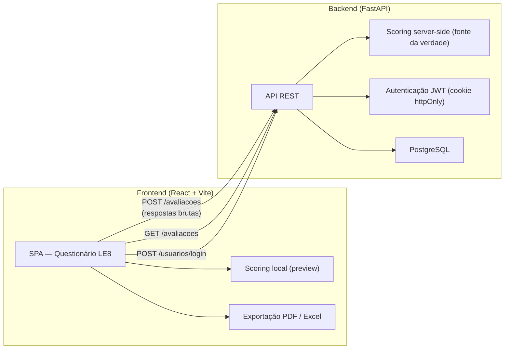

<p align="center">
  
</p>

<h1 align="center">NATSA</h1>

<p align="center">
  Aplicação web de avaliação de saúde cardiovascular baseada na metodologia
  <strong>Life's Essential 8 (LE8)</strong> da American Heart Association (AHA).
</p>

<p align="center">
  
  
  
  
  
  
</p>

---

## Sobre o Projeto

O **NATSA** apresenta ao usuário um questionário estruturado em **8 domínios** da saúde cardiovascular — dieta, atividade física, tabagismo, sono, IMC, colesterol, glicemia e pressão arterial — calcula uma pontuação de 0 a 100 para cada domínio e uma **pontuação composta final**, classificando a saúde cardiovascular como **Baixa**, **Moderada** ou **Alta**.

> [!WARNING]
> Este sistema é uma ferramenta **orientativa** e **não realiza diagnóstico**.
> Não substitui avaliação médica profissional.

### Contexto Acadêmico

Projeto de **Iniciação Científica** desenvolvido na **Universidade Evangélica de Goiás (UniEVANGÉLICA)**, com base na diretriz:

> Lloyd-Jones, D.M. et al. *Life's Essential 8: Updating and Enhancing the American Heart Association's Construct of Cardiovascular Health*. Circulation, 2022;146:e18–e43.

---

## Arquitetura

Monorepo com duas aplicações independentes — o frontend é uma SPA React servida pela Vercel, e o backend é uma API REST em Python/FastAPI com banco PostgreSQL.



---

## Stack Tecnológica

| Camada | Tecnologia |
|---|---|
| **Frontend** | React 19, Vite 8, React Router 7, Context API |
| **Backend** | FastAPI 0.141, SQLModel 0.0.39, Uvicorn |
| **Banco de dados** | PostgreSQL (psycopg2-binary) |
| **Autenticação** | JWT (PyJWT) + bcrypt — token em cookie httpOnly |
| **Exportação** | jsPDF + jspdf-autotable (PDF), SheetJS/xlsx (Excel) |
| **Acessibilidade** | VLibras (tradução para Libras) |
| **Ícones** | Lucide React |

---

## Estrutura do Repositório

```
Life-s-Essential-8/
├── frontend/               # SPA React + Vite
│   ├── src/
│   │   ├── components/     # UI reutilizável (Header, QuestionCard, ScoreBadge...)
│   │   ├── pages/          # Home, Login, Cadastro, Questionnaire, Results, History, Admin
│   │   ├── context/        # AuthContext + AssessmentContext (Context API)
│   │   ├── data/           # Critérios LE8 e steps do questionário
│   │   ├── utils/          # Scoring, API client, exportação PDF/Excel
│   │   ├── hooks/          # useVLibrasRefresh
│   │   └── styles/         # Design tokens (variables.css)
│   ├── vercel.json         # Rewrite para SPA
│   └── package.json
│
├── backend/                # API REST Python
│   ├── app/
│   │   ├── main.py         # FastAPI app + CORS
│   │   ├── models.py       # Tabelas: usuarios, avaliacoes
│   │   ├── schemas.py      # Validação Pydantic (entrada/saída)
│   │   ├── auth.py         # bcrypt + JWT
│   │   ├── scoring.py      # Motor de cálculo LE8 (fonte da verdade)
│   │   ├── le8_criteria.py # Faixas de pontuação espelhadas do front
│   │   ├── dependencies.py # Extração do usuário autenticado
│   │   └── routers/        # usuarios, avaliacoes, estatisticas
│   ├── requirements.txt
│   └── .env                # Não versionado
│
└── docs/
    └── README.md           # Limitações metodológicas
```

---

## Como Rodar Localmente

### Pré-requisitos

- **Node.js** 18+
- **Python** 3.12+
- **PostgreSQL** instalado e rodando (banco `life8_db` criado)

### 1. Backend

```bash
cd backend
python -m venv venv

# Windows
.\venv\Scripts\Activate

# Linux/macOS
source venv/bin/activate

pip install -r requirements.txt
```

Crie o arquivo `backend/.env`:

```dotenv
DB_HOST=localhost
DB_PORT=5432
DB_NAME=life8_db
DB_USER=postgres
DB_PASSWORD=sua_senha_aqui
JWT_SECRET_KEY=uma_string_aleatoria_longa_e_secreta
```

> [!IMPORTANT]
> A variável `JWT_SECRET_KEY` é **obrigatória** — o servidor não inicia sem ela.
> Se a senha do PostgreSQL contiver caracteres especiais (`@`, `/`, `#`), o código já trata isso via `urllib.parse.quote_plus`.

```bash
uvicorn app.main:app --reload
```

API disponível em `http://localhost:8000` · Swagger em `http://localhost:8000/docs`

### 2. Frontend

```bash
cd frontend
npm install
npm run dev
```

Acesse `http://localhost:5173`. O frontend se conecta ao backend em `http://localhost:8000` por padrão (configurável via variável de ambiente `VITE_API_URL`).

---

## Branches e Convenções

### Estrutura de branches

| Branch | Propósito |
|---|---|
| `main` | Versão estável |
| `develop` | Integração contínua das features |
| `feature/*` ou `feat/*` | Desenvolvimento de funcionalidades |

### Convenção de commits

O projeto segue **Conventional Commits**:

```
feat: nova funcionalidade
fix: correção de bug
refactor: refatoração sem alterar comportamento
docs: documentação
```

---

## Documentação Detalhada

| Componente | README |
|---|---|
| Frontend | [`frontend/README.md`](frontend/README.md) |
| Backend | [`backend/README.md`](backend/README.md) |
| Limitações Metodológicas | [`docs/README.md`](docs/README.md) |

---

## Status do Projeto

- [x] Frontend — questionário completo (15 etapas, 8 domínios)
- [x] Backend — API REST com autenticação JWT e persistência
- [x] Integração frontend ↔ backend (scoring server-side como fonte da verdade)
- [x] Autenticação de usuários (cadastro, login, logout via cookie httpOnly)
- [x] Histórico de avaliações persistido no banco
- [x] Exportação de relatórios (PDF e Excel)
- [x] Painel administrativo com estatísticas e listagem de usuários
- [ ] Acessibilidade — widget VLibras (planejado para versão futura)
- [ ] Deploy público (em desenvolvimento)
- [ ] Termo de consentimento / conformidade LGPD
- [ ] Recuperação de senha
- [x] Rate limiting nas rotas de autenticação (SlowAPI)
- [x] Testes automatizados de pontuação (pytest no backend e vitest no frontend)

---

## Executando os Testes

Para garantir a integridade dos cálculos do Life's Essential 8:

```bash
# Testes do Backend (Python / pytest):
cd backend
pytest -v

# Testes do Frontend (JavaScript / Vitest):
cd frontend
npm test
```

---

## Licença

> Licença ainda não definida. Este projeto é parte de um trabalho acadêmico na UniEVANGÉLICA e não possui licença aberta no momento.