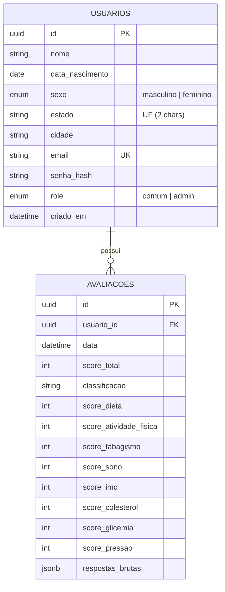
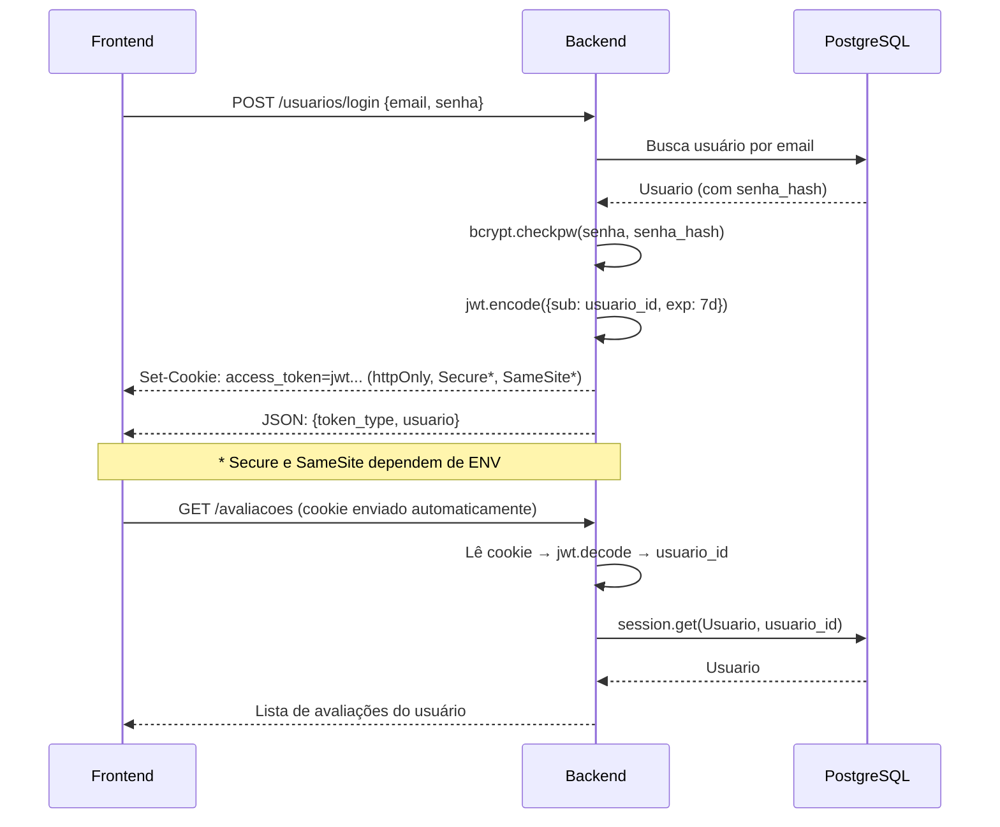

<h1 align="center">NATSA — Backend</h1>

<p align="center">
  API REST em Python responsável pela autenticação de usuários, cálculo
  oficial dos scores LE8 e persistência das avaliações de saúde cardiovascular.
</p>

<p align="center">
  
  
  
  
  
  
</p>

> [!NOTE]
> Este backend roda **localmente** por decisão de escopo do projeto — não é hospedado em infraestrutura institucional no momento.

---

## Stack Técnica

| Camada | Tecnologia | Versão |
|---|---|---|
| Framework | FastAPI | 0.141.1 |
| Servidor ASGI | Uvicorn | 0.52.1 |
| ORM + Validação | SQLModel (SQLAlchemy + Pydantic) | 0.0.39 |
| Banco de dados | PostgreSQL | — |
| Driver do banco | psycopg2-binary | 2.9.12 |
| Hash de senha | bcrypt | 5.0.0 |
| Autenticação | PyJWT (HS256) | 2.13.0 |
| Variáveis de ambiente | python-dotenv | 1.2.2 |
| Validação de email | email-validator | 2.3.0 |

---

## Pré-requisitos

- **Python 3.12+**
- **PostgreSQL** instalado e rodando localmente
- Banco de dados `life8_db` criado

---

## Setup do Ambiente

### 1. Virtualenv e dependências

```bash
cd backend
python -m venv venv

# Windows
.\venv\Scripts\Activate

# Linux/macOS
source venv/bin/activate

pip install -r requirements.txt
```

### 2. Variáveis de ambiente

Crie o arquivo `.env` na raiz de `backend/` (nunca versionado — já está no `.gitignore`):

```dotenv
DB_HOST=localhost
DB_PORT=5432
DB_NAME=life8_db
DB_USER=postgres
DB_PASSWORD=sua_senha_aqui
JWT_SECRET_KEY=uma_string_aleatoria_longa_e_secreta
```

> [!IMPORTANT]
> A variável `JWT_SECRET_KEY` é **obrigatória** — a aplicação lança `RuntimeError` se não estiver definida.

> [!TIP]
> Se sua senha do PostgreSQL contiver caracteres especiais (`@`, `/`, `#`, etc.), **não é necessário escapar manualmente** — o código em `database.py` já usa `urllib.parse.quote_plus` para tratar isso automaticamente.

### 3. Variáveis opcionais

| Variável | Padrão | Descrição |
|---|---|---|
| `ENV` | `dev` | Define o ambiente. Quando `production`: CORS restrito à `FRONTEND_URL`, cookie com `Secure=True` e `SameSite=None` |
| `FRONTEND_URL` | — | Origem(ns) do frontend para CORS em produção (separadas por vírgula). Em dev, é automaticamente `http://localhost:5173` |

---

## Rodando o Servidor

```bash
uvicorn app.main:app --reload
```

- **API**: `http://localhost:8000`
- **Swagger UI**: `http://localhost:8000/docs`
- **ReDoc**: `http://localhost:8000/redoc`

---

## Estrutura do Projeto

```
backend/
├── app/
│   ├── __init__.py
│   ├── main.py            # FastAPI app, CORS, registro de routers, health check
│   ├── database.py        # Engine SQLModel, conexão com PostgreSQL
│   ├── models.py          # Tabelas do banco (SQLModel): usuarios, avaliacoes
│   ├── schemas.py         # Schemas Pydantic de entrada/saída da API
│   ├── auth.py            # Hash bcrypt + geração/validação JWT + config de cookie
│   ├── dependencies.py    # Dependências FastAPI: get_usuario_atual, get_usuario_admin
│   ├── scoring.py         # Motor de cálculo LE8 (fonte da verdade)
│   ├── le8_criteria.py    # Faixas de pontuação (espelho do front)
│   └── routers/
│       ├── usuarios.py    # Autenticação: cadastro, login, logout, me
│       ├── avaliacoes.py  # CRUD de avaliações
│       └── estatisticas.py # Painel admin: listagem de usuários + resumo
│
├── requirements.txt
├── .env                   # Não versionado
└── .gitignore
```

---

## Modelo de Dados



### Tabela `usuarios`

- `id` — UUID v4, gerado automaticamente
- `email` — único, indexado
- `senha_hash` — bcrypt, truncado em 72 bytes (limite do algoritmo)
- `role` — `comum` (padrão) ou `admin`
- `estado` — UF, normalizado para maiúsculo via validator

### Tabela `avaliacoes`

- `usuario_id` — FK para `usuarios.id`, com `ON DELETE CASCADE`
- `respostas_brutas` — coluna JSONB com todas as respostas do questionário no formato original
- `score_*` — cada domínio tem sua coluna numérica (0–100)
- `classificacao` — `"baixa"`, `"moderada"` ou `"alta"`

---

## Endpoints da API

### Saúde

| Método | Rota | Auth | Descrição |
|---|---|---|---|
| GET | `/` | Não | Status da API |
| GET | `/health/db` | Não | Verifica conexão com o banco |

---

### Autenticação — `/usuarios`

| Método | Rota | Auth | Descrição |
|---|---|---|---|
| POST | `/usuarios/cadastro` | Não | Cria conta e retorna cookie de autenticação |
| POST | `/usuarios/login` | Não | Autentica com email/senha e seta cookie |
| POST | `/usuarios/logout` | Não | Remove o cookie de autenticação |
| GET | `/usuarios/me` | Sim | Retorna dados do usuário autenticado |

**Corpo de `POST /usuarios/cadastro`:**
```json
{
  "nome": "string",
  "data_nascimento": "2000-01-15",
  "sexo": "masculino | feminino",
  "estado": "GO",
  "cidade": "Anápolis",
  "email": "usuario@exemplo.com",
  "senha": "mínimo 8, máximo 72 caracteres"
}
```

**Resposta (`TokenResposta`):**
```json
{
  "token_type": "bearer",
  "usuario": {
    "id": "uuid",
    "nome": "string",
    "data_nascimento": "2000-01-15",
    "sexo": "masculino",
    "estado": "GO",
    "cidade": "Anápolis",
    "email": "string",
    "role": "comum",
    "idade": 26,
    "criado_em": "timestamp"
  }
}
```

> [!IMPORTANT]
> O token JWT **não é retornado no corpo JSON** — ele é enviado exclusivamente via **cookie httpOnly** (`access_token`), impedindo acesso por JavaScript e mitigando risco de XSS.

---

### Avaliações — `/avaliacoes`

Todas as rotas exigem autenticação (cookie JWT).

| Método | Rota | Descrição |
|---|---|---|
| POST | `/avaliacoes` | Envia respostas brutas → backend calcula scores e persiste |
| GET | `/avaliacoes` | Lista histórico de avaliações do usuário autenticado (mais recente primeiro) |

**Corpo de `POST /avaliacoes`:**
```json
{
  "respostas_brutas": {
    "diet": { "fruitsVeggies": 2, "wholeGrains": 1, ... },
    "physicalActivityMinutes": 150,
    "nicotineStatus": "never",
    "sleepHours": 7.5,
    "weightKg": 70,
    "heightM": 1.75,
    "nonHdlCholesterol": 120,
    "lipidsMedication": false,
    "fastingGlucose": 90,
    "hba1c": null,
    "glucoseMedication": false,
    "systolic": 115,
    "diastolic": 75
  }
}
```

**Resposta (`AvaliacaoResposta`):**
```json
{
  "id": "uuid",
  "data": "timestamp",
  "score_total": 85,
  "classificacao": "alta",
  "score_dieta": 80,
  "score_atividade_fisica": 100,
  "score_tabagismo": 100,
  "score_sono": 100,
  "score_imc": 100,
  "score_colesterol": 60,
  "score_glicemia": 100,
  "score_pressao": 100,
  "respostas_brutas": { ... }
}
```

---

### Administração — `/admin/estatisticas`

Todas as rotas exigem autenticação + `role = admin`.

| Método | Rota | Descrição |
|---|---|---|
| GET | `/admin/estatisticas/resumo` | Resumo geral: total de usuários, avaliações, score médio, médias por domínio e sexo, distribuição por classificação |
| GET | `/admin/estatisticas/usuarios` | Listagem paginada de usuários com filtros |

**Query params de `/admin/estatisticas/usuarios`:**

| Parâmetro | Tipo | Descrição |
|---|---|---|
| `sexo` | `masculino` \| `feminino` | Filtro por sexo |
| `estado` | string (UF) | Filtro por estado |
| `cidade` | string | Filtro por cidade |
| `idade_min` | int (0–130) | Idade mínima |
| `idade_max` | int (0–130) | Idade máxima |
| `pagina` | int (≥ 1) | Página (padrão: 1) |
| `limite` | int (1–100) | Itens por página (padrão: 20) |

---

## Autenticação — Como Funciona



### Detalhes da implementação

- **Hash**: bcrypt com salt automático. Senha truncada em 72 bytes (limite do algoritmo).
- **Token**: JWT HS256, expira em **7 dias**.
- **Cookie**: httpOnly (inacessível por JS), com `path=/`.
  - Em **dev** (`ENV=dev`): `Secure=False`, `SameSite=Lax` (funciona com localhost).
  - Em **produção** (`ENV=production`): `Secure=True`, `SameSite=None` (necessário para cross-site).
- **Proteção contra enumeração**: mensagens de erro de login idênticas para "email não existe" e "senha incorreta". Além disso, um hash dummy é computado quando o email não existe (constant-time).
- **Admin**: dependência `get_usuario_admin` verifica `role == "admin"` e retorna HTTP 403 se não.

---

## Motor de Scoring (Fonte da Verdade)

O cálculo dos scores no backend (`scoring.py` + `le8_criteria.py`) **espelha** a lógica do frontend (`scoring.js` + `le8Criteria.js`), mas é a **fonte da verdade** — os scores persistidos no banco vêm sempre do backend.

### Domínios calculados

| Domínio | Função | Input |
|---|---|---|
| Dieta | `score_diet()` | Soma dos 8 itens (0–16 pts) → faixa |
| Atividade Física | `score_physical_activity()` | Minutos/semana → faixa |
| Tabagismo | `score_nicotine()` | Opção selecionada → pontos diretos |
| Sono | `score_sleep()` | Horas/noite → faixa (ordem significativa!) |
| IMC | `score_bmi()` | Peso/Altura² → faixa |
| Colesterol | `score_blood_lipids()` | mg/dL → faixa (−20 se medicação) |
| Glicemia | `score_blood_glucose()` | Glicemia jejum ou HbA1c → faixa (−20 se medicação) |
| Pressão | `score_blood_pressure()` | Sistólica + diastólica → faixa |

- **Score composto**: média aritmética dos 8 domínios, arredondada.
- **Classificação**: `baixa` (≤ 49), `moderada` (50–79), `alta` (80–100).

> [!CAUTION]
> Os critérios em `le8_criteria.py` e `le8Criteria.js` devem ser mantidos **sincronizados manualmente**. Qualquer alteração em um deve ser replicada no outro.

---

## Segurança — Decisões Implementadas

| Aspecto | Implementação |
|---|---|
| Senhas | Nunca em texto puro — hash via bcrypt, truncado em 72 bytes |
| Token | JWT HS256, expira em 7 dias, entregue via cookie httpOnly |
| Isolamento de dados | `GET /avaliacoes` filtra por `usuario_id` do token — um usuário nunca acessa avaliações de outro |
| Anti-enumeração | Mensagem de erro idêntica + hash dummy para timing constante |
| Rate Limiting | Limite de 5 req/min por IP em `/usuarios/login` e `/usuarios/cadastro` via SlowAPI (HTTP 429) |
| CORS | Dev: `localhost:5173`. Produção: origens configuráveis via `FRONTEND_URL` |
| Admin | Rotas protegidas por `get_usuario_admin` (verifica `role == admin`) |

---

## Limitações Conhecidas / Próximos Passos

- [ ] Deploy público do backend (atualmente roda apenas local)
- [ ] Endpoint de recuperação de senha
- [x] Rate limiting nas rotas de login/cadastro
- [ ] Migrations automatizadas (atualmente as tabelas são criadas via SQLModel `create_all` ou SQL manual)
- [ ] Fonte única de verdade para critérios LE8 (hoje é duplicado entre front e back)
- [ ] Termo de consentimento / conformidade LGPD para dados sensíveis de saúde

---

## Referência Científica

Lloyd-Jones, D.M. et al. *Life's Essential 8: Updating and Enhancing the American Heart Association's Construct of Cardiovascular Health*. Circulation, 2022;146:e18–e43.